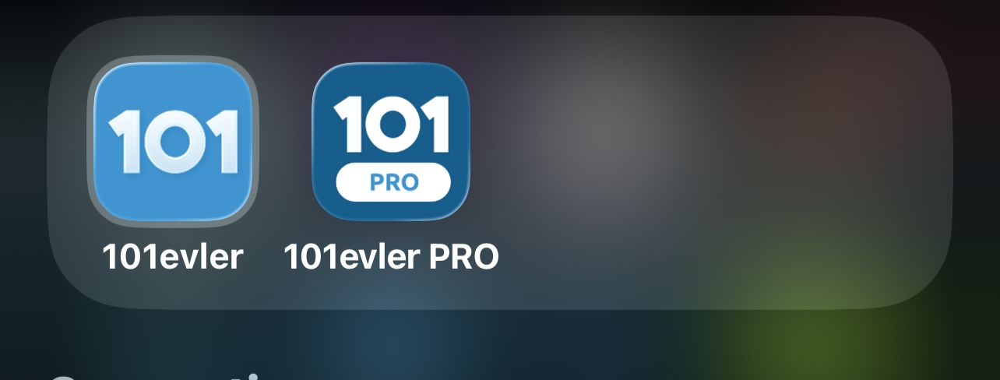

# RSA - Real state application

examples of similer applications

1 . 
2 . 

Prefered : 
 - supabase edge functions and triggers for data mutations and client only call the function
 - publishable key insted of anon key
 - supbase jwt signing keys insted of legacy key, and remove the revoked keys later
 - RLS for all tables
 - i'm gonna use stylesheet, if you want tailwind install it
 - AsyncStorage only for supabase auth
 - mmkv cache for all other components
 - git rebase insted of git mergre
 - we gonna use RN newArch=True
 - keep /ios /android in git
 - centralize error codes and messeges in one .ts file (for each component) and map over them
 - add any new env to eas.json, on both images (development, production) cuz i'm mainly developing with real phone not simulator
 - lets use one full migration file that have the full schema >> sync the remote and local
 - i think we can save time and skip google, apple sign in and only use phone-number for verifications 
 - default = pnpm

 - add more rules if you want
 - ..
 - ..

| Dev  
| ------------- 
| [ ] Setup supabase project  
| [ ] Setup Twillo and add it to supabase providers table
| [ ] Setup apple bundleIdentifier  
| [ ] Setup sentry 
| [ ] Setup Notifications service id from apple developer   
| [ ] Add all env and cret to EAS  
| [ ] lets decide color patters and layout patterns  
| [ ] splashScreen
| [ ] Landing screen with redirect to phone input and code verification
| [ ] registrations forms after phone verifications  
| [ ] Setup the table for rejesterd users  
| [ ] Functions to upsert users  
| [ ] fallback for any errors so far  
| [ ] main screen layout (navigation bar)  
| [ ] divide the screen between us  
| [ ]....  
| [ ]....  
| [ ]....  
| [ ]....  
| [ ]....  
| [ ]....  
| [ ]....  
| [ ]....  
| [ ]....  
| [ ]....  
| [ ]....  
